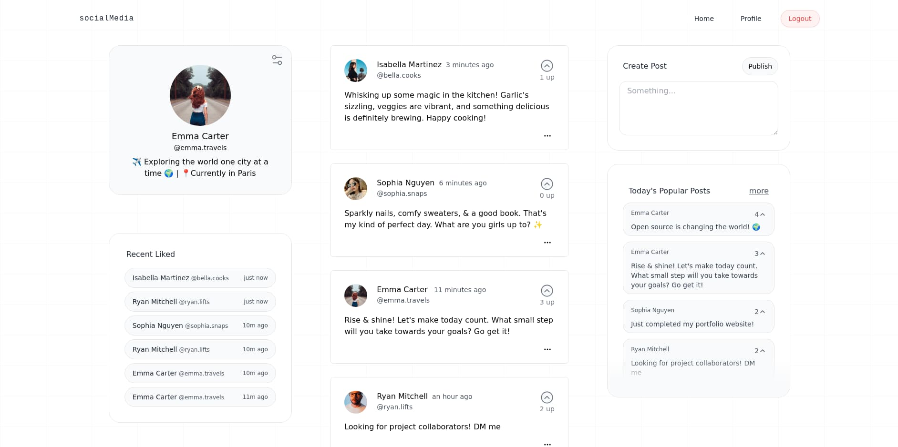
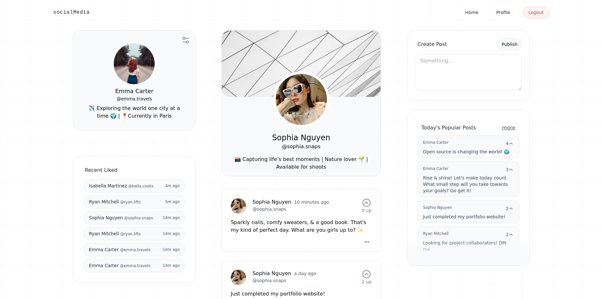
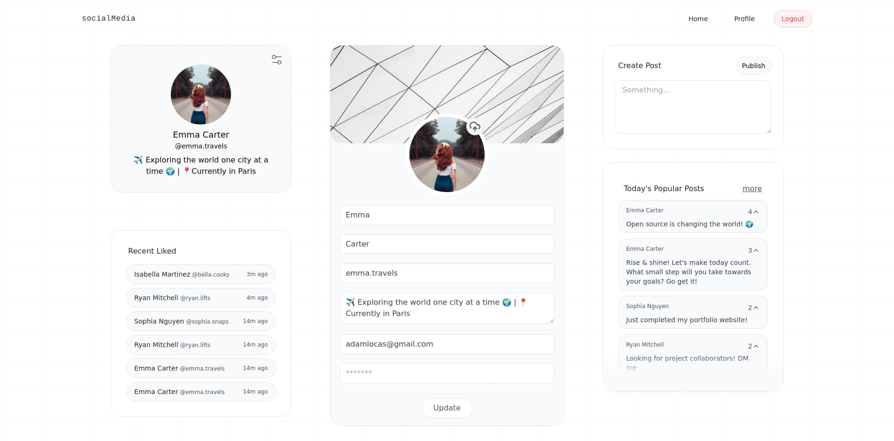
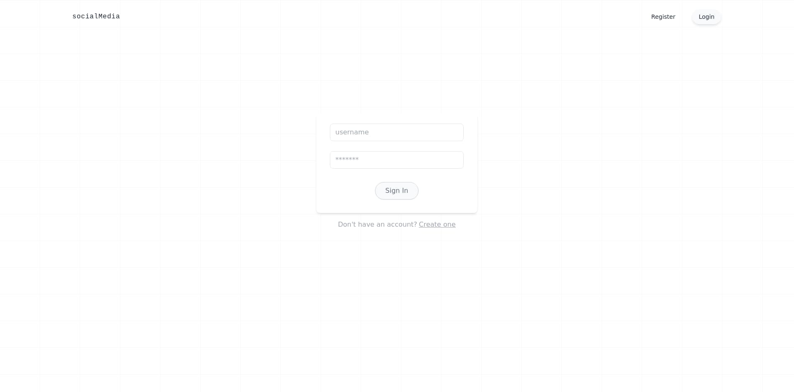
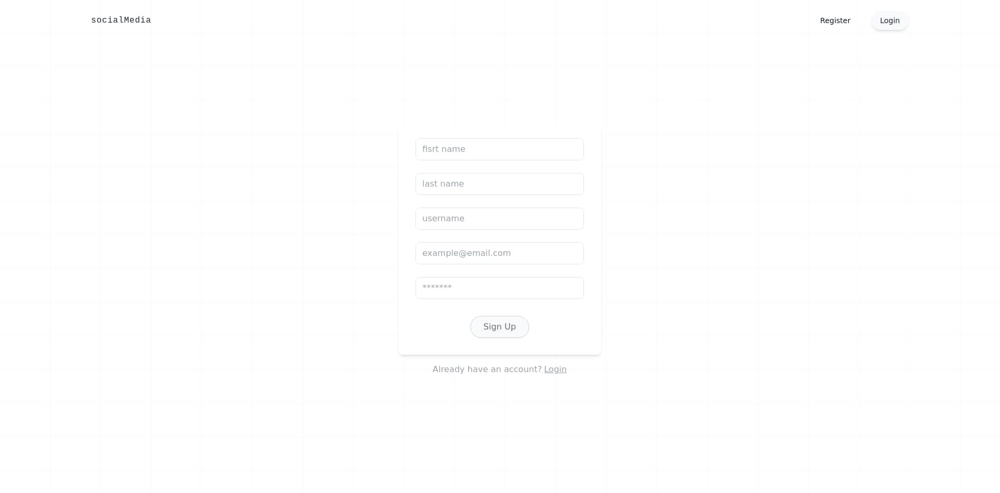

# Social Media Application

A social media platform built with FastAPI and React that allows users to create profiles, share posts, and interact with other users through likes/votes.



## Features

- **User Authentication**
  - Register with email and username
  - Secure login/logout functionality
  - JWT token-based authentication

- **User Profile**
  - Customizable profile information
  - Profile picture upload
  - Bio and personal details
  - View other users' profiles

- **Posts**
  - Create text-based posts
  - View posts from all users
  - Vote/like posts
  - Delete own posts

- **Social Features**
  - View popular posts
  - See recent liked posts
  - Real-time vote counts
  - User mentions

## Screenshots

| Profile Page | Edit Profile Page |
|-----------|--------------|
|||

| Login Page | Register Page |
|-----------|--------------|
|||

## Tech Stack

### Backend
- FastAPI (Python web framework)
- MySQL (Database)
- SQLAlchemy (ORM)
- Alembic (Database migrations)
- JWT Authentication
- Python 3.10+

### Frontend
- React 18
- React Router v6
- Tailwind CSS
- shadcn/ui Components
- React Hook Form
- Zod Validation

## Installation

### Prerequisites
- Python 3.10+
- Node.js 16+
- MySQL

### Backend Setup

1. Clone the repository
```bash
git clone https://github.com/fartoot/social-media-app.git
cd social-media-app/backend
```

2. Create and activate virtual environment
```bash
python -m venv venv
source venv/bin/activate  # Linux/Mac
# or
venv\Scripts\activate  # Windows
```

3. Install dependencies
```bash
pip install -r requirements.txt
```

4. Create .env file in backend directory
```env
DATABASE_HOSTNAME=localhost
DATABASE_PORT=3306
DATABASE_PASSWORD=your_password
DATABASE_NAME=your_db_name
DATABASE_USERNAME=your_username
SECRET_KEY=your_secret_key
ALGORITHM=HS256
ACCESS_TOKEN_EXPIRE_MINUTES=60
```

5. Run database migrations
```bash
alembic upgrade head
```

6. Start the backend server
```bash
uvicorn app.main:app --reload
```

### Frontend Setup

1. Navigate to frontend directory
```bash
cd ../frontend
```

2. Install dependencies
```bash
npm install
```

3. Start the development server
```bash
npm run dev
```


### Main API Endpoints

- `POST /users/` - Register new user
- `POST /login/` - User login
- `GET /posts/` - Get all posts
- `POST /posts/` - Create new post
- `POST /votes/` - Vote/like a post
- `GET /users/{id}` - Get user profile
- `PUT /users/` - Update user profile

## Acknowledgments

- [FastAPI](https://fastapi.tiangolo.com/)
- [React](https://reactjs.org/)
- [Tailwind CSS](https://tailwindcss.com/)
- [shadcn/ui](https://ui.shadcn.com/)